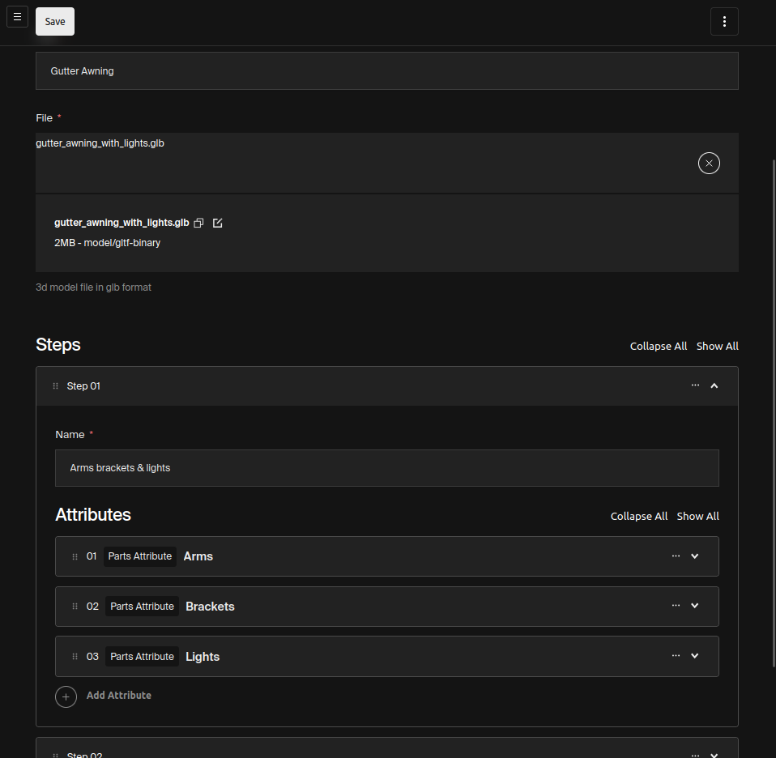
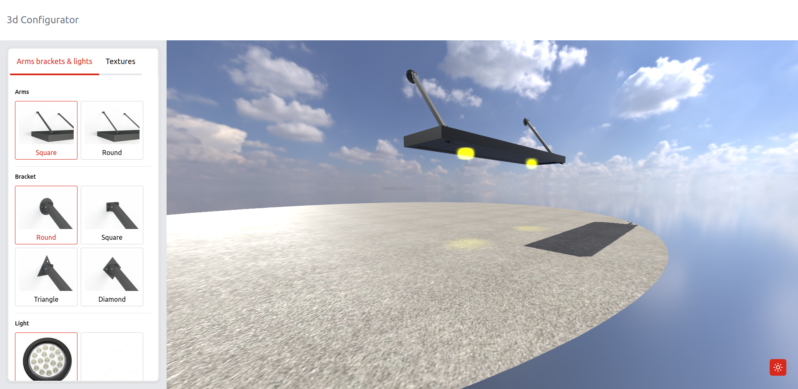
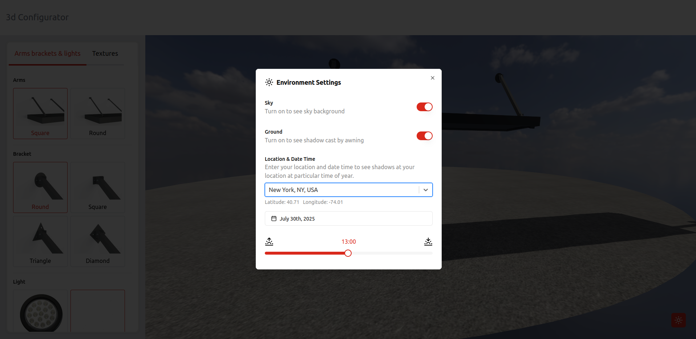

# 3d Configurator

A 3D configurator where users can upload 3d models and create interactive product configurators through the admin panel.

## Features

- Admin dashboard to create / edit 3d configurators
- Accurate shadows based on location and date/time
- Texture and colors library
- Flexible data model, using attributes, options, actions 
- 6 attribute types
- Payload CMS

## Screenshots
**Admin panel to create configurable models**



**Configurator screenshot**



Enviroment settings for accurate shadows, based on location, date & time



## Attribute Types

*   **Parts Attribute**
    *   **What it does:** Lets you swap entire components.
    *   **Example:** Changing a car's wheels or a chair's legs.

*   **Color Attribute**
    *   **What it does:** Applies a specific color.
    *   **Example:** Picking the paint color for a car or the fabric color for a sofa.

*   **Texture Attribute**
    *   **What it does:** Applies a pre-made surface pattern or look.
    *   **Example:** Choosing a wood grain, brick, or fabric pattern.

*   **User Image Attribute**
    *   **What it does:** Lets users upload their own picture to put on the model.
    *   **Example:** Adding your company logo to a product or a custom photo to a picture frame.

*   **Building Image Attribute**
    *   **What it does:** Adds a large background image, usually for context.
    *   **Example:** Placing a 3D building model into a photo of a real-world city street.

*   **Manual Select Attribute**
    *   **What it does:** An **advanced** option for highly specific or complex changes not covered above.
    *   **Example:** For adding lights to a scene, or applying advance texture with multiple image maps, normal maps etc

## Getting started

**Copy env file**

`cp ./example.env ./.env`

You might need to add google maps key to `VITE_MAP_KEY` env variable

**Start the Development Server** 

`docker compose up`

**Seed Initial Data**

Wait for the container to start before running this script

`./seed.sh`

**Configurator**

Visit [http://localhost:5173](http://localhost:5173)

**Admin Panel**

Visit [http://localhost:3000/admin](http://localhost:3000/admin)

Use these creds to login
```
email: admin@example.com
password: password
```

Visit models section in admin to see example models.

## TODO
- [x] Demo site with mock data
- [ ] Model perparation guide
- [ ] Admin guide